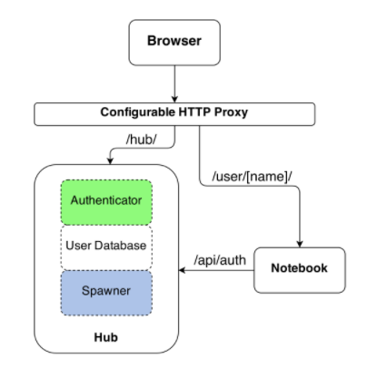

<!-- $theme: gaia -->

## Jupyter Hub

##### _Kun_
###### March 6, 2017

---

### Interesting Features


- Configurable ==http proxy== (node-http-proxy)
- Well written ==documentation==
- ==Authenticators==
- ==Spawners==

---

### Architecture

- a notebook server process **for each user** ([Slide](https://www.slideshare.net/willingc/jupyterhub-a-thing-explainer-overview#L18))
- use **global http proxy** to handle, redirect requests





---

### How to run (w/ Docker)

Dosen't work :sob:

```
docker run -p 8000:8000 --name jupyterhub --rm jupyterhub/jupyterhub jupyterhub
```

---

### How to run (w/o Docker)

```
pyenv local 3.6.0

npm install -g configurable-http-proxy
pip3 install jupyterhub notebook

# jupyterhub --generate-config

jupyterhub
```

---

## DEMO

---

### Cluster Computing for Python

- [ipyparallel](https://github.com/ipython/ipyparallel)


---

### Authenticator

- PAM (default)
- [OAuth](https://github.com/jupyterhub/oauthenticator) - Github, Gitlab, Google, Openshift, ...
- [LDAP](https://github.com/jupyterhub/ldapauthenticator)

---

### Authenticator: ==Config==


1. Install [oauthenticator](https://github.com/jupyterhub/oauthenticator) and set `jupyterhub_config.py`

```python
c.JupyterHub.authenticator_class ='oauthenticator.GitHubOAuthenticator'
import os
c.GitHubOAuthenticator.oauth_callback_url = os.environ['OAUTH_CALLBACK_URL']
c.GitHubOAuthenticator.client_id = os.environ['GITHUB_CLIENT_ID']
c.GitHubOAuthenticator.client_secret = os.environ['GITHUB_CLIENT_SECRET']
```

2. Then, run jupyterhub with envs

```sh
OAUTH_CALLBACK_URL=http://your-public-domain:8000 \ 
GITHUB_CLIENT_ID=YOUR_CLIENT_ID \ 
GITHUB_CLIENT_SECRET=YOUR_SECCRET \
jupyterhub
```

---

### Authenticator: ==Implementation==

- jupyterhub: [LocalAuthenticator](https://github.com/jupyterhub/jupyterhub/blob/b47f76c0377ca4cd1ab6bff920493145235db339/jupyterhub/auth.py#L303)
- oauthenticator: [GithubAuthenticator](https://github.com/jupyterhub/oauthenticator/blob/bba52fc4c570b5eb8d6a252fd690b5231962e01f/oauthenticator/github.py#L39)

---

### Spawner

- local-process (default)
- [docker](https://github.com/jupyterhub/dockerspawner)
- [kube](https://github.com/jupyterhub/kubespawner)
- [sudo](https://github.com/jupyterhub/sudospawner): w/o being root
- [systemd](https://github.com/jupyterhub/systemdspawner)
- [batch](https://github.com/jupyterhub/batchspawner): for clusters using batch scheduling
- [wrap](https://github.com/jupyterhub/wrapspawner): enabling runtime configuration of spawners

Spawner supports [resource limitation](https://jupyterhub.readthedocs.io/en/latest/spawners.html#spawners-resource-limits-and-guarantees-optional)

---

### Docker Spawner: ==Config==

1. install [dockerspawner](https://github.com/jupyterhub/dockerspawner) and build docker image

```shell
cd dockerspawner
pip install -r requirements.txt
python setup.py install
docker build -t jupyterhub/singleuser singleuser
```

2. Setup spawner in `jupyterhub_config.py` ([issue#291](https://github.com/jupyterhub/jupyterhub/issues/291#issuecomment-134491259))

```
c.JupyterHub.spawner_class = 'dockerspawner.DockerSpawner'
c.DockerSpawner.hub_ip_connect = 'your-local-ip-addr'
c.JupyterHub.hub_ip = 'your-local-ip-addr'
```

---

### Docker Spawner: ==Implementation==

jupyterhub: [spawner.py](https://github.com/jupyterhub/jupyterhub/blob/b47f76c0377ca4cd1ab6bff920493145235db339/jupyterhub/spawner.py#L33-L52)
jupyterhub: [dockerspawner - singleuser](https://github.com/jupyterhub/dockerspawner/tree/master/singleuser)
jupyterhub [scripts/singleuser.py](https://github.com/jupyterhub/jupyterhub/blob/0.6.1/scripts/jupyterhub-singleuser)


--- 

### Kube Spawner

- [Setup jupyterhub on kubernetes with LDAP]( http://danielfrg.com/blog/2016/09/03/jupyterhub-kubernetes-ldap/)

---

### Features which Zeppelin doens't have

- Well abstracted ==authenticator==, ==spawner== layers
- Edit metadata for note / paragraph
- Toggle header, toolbar (more like IDE)
- ==Cell toolbar==
- Fertile ==help== button
- Merging cells

---


### References

- Docs: [JupyterHub](https://jupyterhub.readthedocs.io/en/latest/)
- Docs: [JupyterHub Authenticators](https://jupyterhub.readthedocs.io/en/latest/authenticators.html)
- Docs: [JupyterHub Spwaners](https://jupyterhub.readthedocs.io/en/latest/spawners.html)
- Video: [Deploying Jupyter Notebooks](https://www.youtube.com/watch?v=gSVvxOchT8Y&feature=youtu.be)
- Slide: [Jupyterhub Overview](https://www.slideshare.net/willingc/jupyterhub-a-thing-explainer-overview)
- Issue: [jupyterhub #291](https://github.com/jupyterhub/jupyterhub/issues/291#issuecomment-134491259)